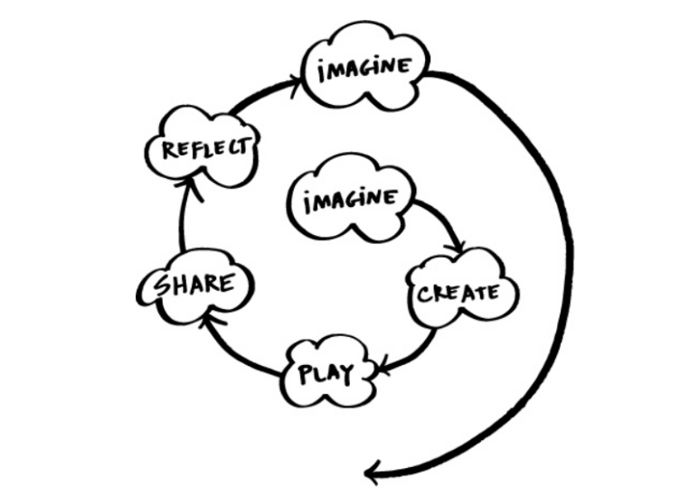

# creative-learning-cycles

This repository holds cycles following the methodology of creative learning.
The goal is to explore full-stack development using Go for a serverless backend on the Google Cloud Platform and 
Flutter for the frontend.

## Creative Learning

From observations of how kindergarten kids learn, MIT came up with a simple definition:

1. Have an idea of what you want to make
2. Make it
3. Play with it
4. Show it to others
5. Look back on it

and you can start again.

So, let's start right away

## Cycles 

- [Send a JSON object via HTTPS request to a Cloud Function in Go and save it in Firestore](cycle_1/README.md)

## Cycles {#cycles}

